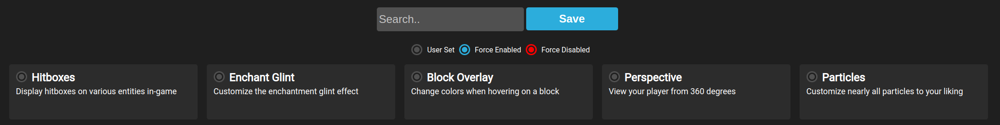

# Config Generator for BadlionClientModAPI



Welcome to the Badlion Client Config Generator for BadlionClientModAPI project! This open-source Dart web application is designed to simplify the process of generating configuration files for the [Badlion Client Mod API](https://github.com/BadlionClient/BadlionClientModAPI). With this tool, server administrators can easily create custom configurations to control and limit various aspects of Badlion Client mods and features for players connecting to their Minecraft servers.

## Table of Contents

- [Introduction](#introduction)
- [Features](#features)
- [License](#license)

## Introduction

The Badlion Client Config Generator simplifies the process of creating configuration files for the BadlionClientModAPI. Badlion Client is a popular Minecraft client that offers various mods and features to enhance gameplay. The BadlionClientModAPI allows server administrators to have more control over how these mods and features behave on their servers. This web app provides an intuitive interface to generate the necessary configuration files without the need to manually edit complex JSON files.

## Features

- User-friendly web interface for generating Badlion Client mod configuration files.
- Fine-grained control over which mods and mod features are allowed or restricted.
- Set limitations on player's clicks per second (CPS) directly from the configuration.
- Create Waypoints in an intuative UI

## License

This project is licensed under the [MIT License](LICENSE).

## Getting Started

To generate the the missing data.g.part run the following command
```shell
dart run build_runner build
```

---

*Disclaimer: This project is not affiliated with or endorsed by Badlion Client or its creators. It is an independent open-source project created by the community for the community.*